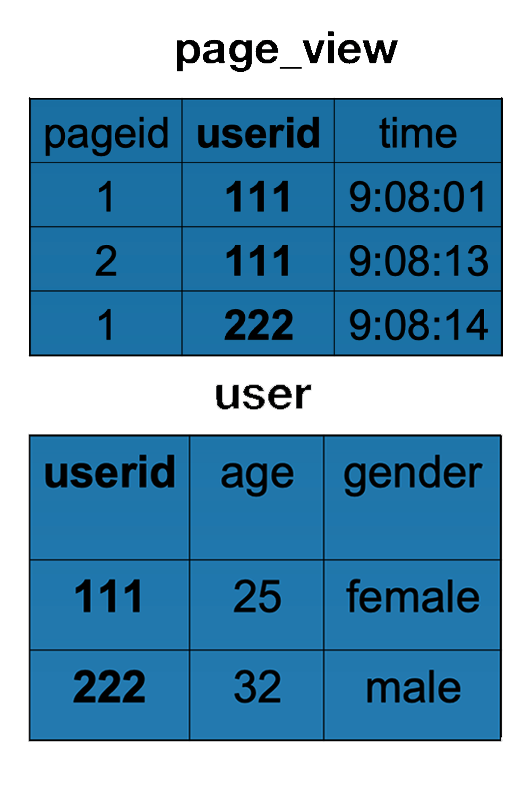

分析如下 HiveQL，生成的 MapReduce 执行程序，map 函数输入是什么？输出是什么，reduce 函数输入是什么？输出是什么？

    INSERT OVERWRITE TABLE pv_users
    SELECT pv.pageid, u.age
    FROM page_view pv
       JOIN user u
       ON (pv.userid = u.userid);

## Mapper `Page_View` 输出

    111 <1,1>
    111 <1,2>
    222 <1,1>

## Mapper `User` 输出

    111 <2,25>
    222 <2,32>

## `Shuffle`操作输出结果

Key为111数据进入一个`Reducer`

    111 <1,1>
    111 <1,2>
    111 <2,25>

Key为222进入另一个`Reducer`

    222 <1,1>
    222 <2,32>

## Reducer输出

接收Key为111数据的`Reducer`的输出结果是

    <1,25>
    <2,25>

接收Key为222数据的`Reducer`的输出结果是

    <1,32>

