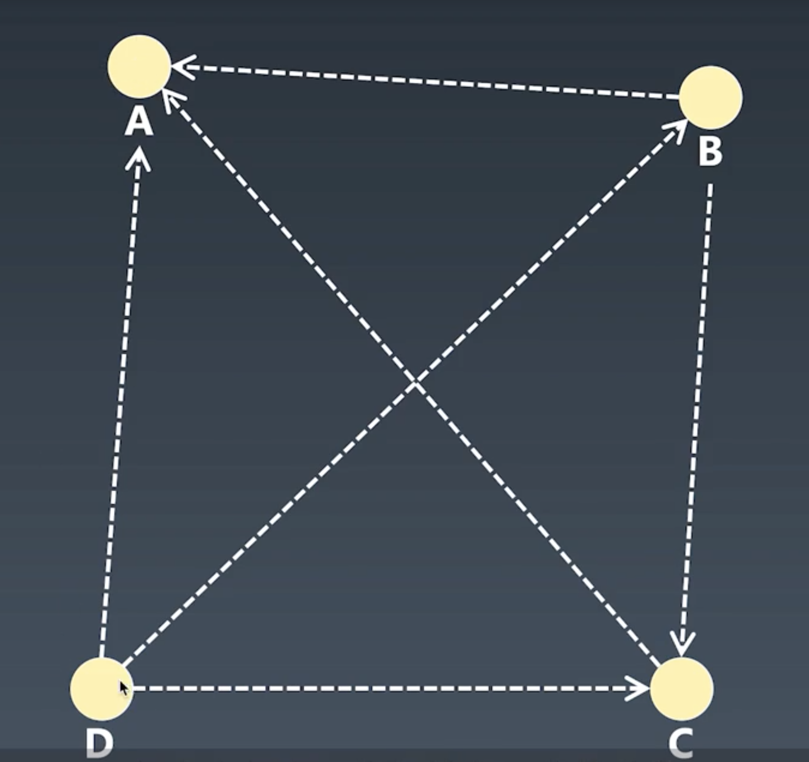

# PageRank算法

## 简介

本算法的另一个名字叫做网页排名，是一种有搜索引擎使用的，一句网页之间超级链接指向关系来计算网页排名的算法，计算结果用于搜索引擎的搜索结果，网页排名得分越高的网页，越是被放置在搜索结果列表的前面的位置。

## 算法原理

网页上会包含指向其他网页的链接。一个网页被其他网页上的超级链接引用指向的次数越多，这个网页的内容质量得分排名越高。反之，内容糟糕的网页不会或者极少被其他网页的超级链接引用指向。

以上就是网页排名算法的内在逻辑。

## 算法实现

网页排名的得分由其他网页指向被排名网页的超级链接数量来决定。

简单的说，当页面B的一个超级链接指向了A页面，就相当于A页面给B页面的内容投了一个赞成票。B页面接收到的、来自其他页面的赞成票越多，网页排名得分就越高。

如下图所示，有三个页面都包含了指向A页面的超级链接，因此A页面的网页排名得分最高。

假设计算开始的时候，每一个网页都有一个相等的网页排名得分：1分。

用数学公式表达如下：

    PR(A) = PR(B) + PR(C) + PR(D)

上图中，B、C、D每个页面都有一个超级链接指向A页面

    PR(B) = 1/LinkCount(B) = 1/B页面指向外部网页的链接总数 = 1/2 = 0.5

    PR(C) = 1/LinkCount(C) = 1/C页面指向外部网页的链接总数  = 1/1 = 1

    PR(D) = 1//LinkCount(D) =1/D页面指向外部网页的链接总数   =1/3 = 0.333

同理可得其他几个网页的排名得分。

每当有有新的网页加入，就需要根据新的链接指向关系重新进行一次网页排名得分运算。

## 杜绝排名作弊

某些网页为了欺骗网页排名算法，作弊网页会引入指向自身的超级链接。为了避免任何网页这种作弊链接”自己给自己投票“，算法设计者在计算过程中引入了随机浏览模型。

假如在计算过程中发现某个链接指向自身，那么算法会随机在当前被计算的所有网页中选择一个网页，从那个网页的链接开始为其他网页投票。

