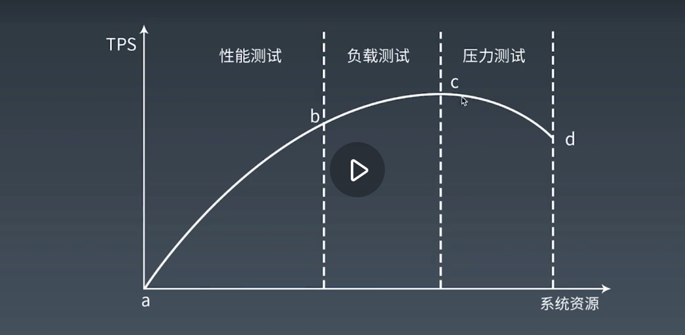
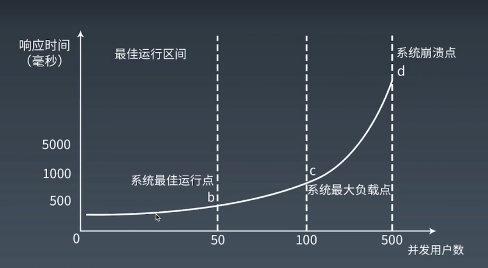

# 系统吞吐量

## 什么是系统吞吐量

吞吐量指的是系统单位时间内能够处理多少个事务。

## 吞吐量与并发数的关系

随着系统并发请求数量的上升，系统吞吐量会经过以下几个阶段的变化:

1. 系统资源充足，系统吞吐量保持快速线性增长
2. 系统资源充分利用，系统吞吐量保持稳定在某一个水平不在上升
3. 系统资源匮乏，过多的并发请求导致操作系统不得不调度更低效率的内存资源，导致系统综合处理能力下降，系统吞吐量受到影响开始下降 

# 系统响应时间

## 什么是系统响应时间

响应时间指的是从用户的角度看，从发起请求开始计算，到用户从应用服务接收到服务响应结束中间的这段时间。

包括以下部分:
1. 服务本身处理请求生成响应的服务时间
2. 请求和响应的网络传输时间

## 系统响应时间的变化趋势

随着系统并发请求数量的上升，系统响应时间会经过以下几个阶段的变化:

1. 系统资源充足，系统以最短的时间处理完用户请求，用户不会发现响应时间基本没有增长
2. 系统资源遇到瓶颈，此时某些用户请求可能要等待系统资源，系统响应时间有小幅上升，但总体上系统可以很好处理所有用户请求
3. 系统资源匮乏，用户请求会对系统资源形成激烈争用，系统响应时间快速飙升 

